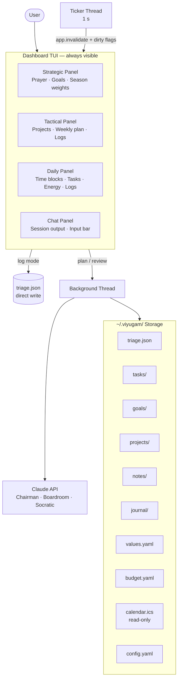
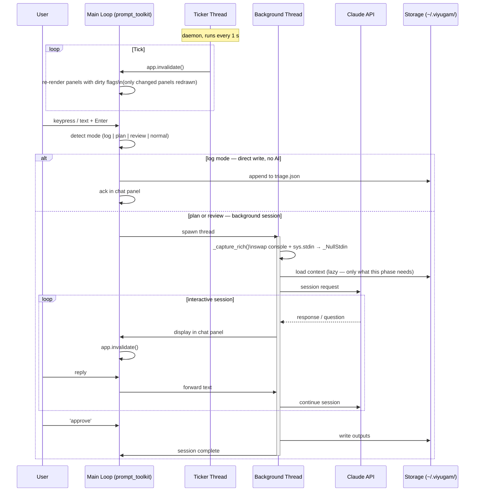

# Architecture

## High-Level System Overview



## Dashboard Panels

### Strategic panel
```
┌─ Strategic ──────────────────────────┐
│ [Prayer / values distillation]        │
│                                       │
│ Q2 Goals                              │
│  G-001 · Launch beta          ██░░░   │
│  G-002 · 6 months runway      ███░░   │
│                                       │
│ Season weights                        │
│  career 35% · wealth 20%             │
│  health 20% · learning 15%           │
│  joy 10%                              │
│                                       │
│ 47 days remaining in quarter          │
└───────────────────────────────────────┘
```

### Tactical panel
```
┌─ Tactical ───────────────────────────┐
│ This week · W08                       │
│  P-003 · API redesign      3 tasks   │
│  P-007 · Health baseline   1 task    │
│                                       │
│ Budget · Feb                          │
│  Operations  $320 / $500             │
│  Learning     $80 / $200             │
│                                       │
│ Recent logs                           │
│  · call with supplier re: pricing    │
│  · need to fix auth flow             │
└───────────────────────────────────────┘
```

### Daily panel
```
┌─ Daily ──────────────────────────────┐
│ Thu 27 Feb  · Energy: moderate        │
│                                       │
│ 09:00  T-023 · Finish API spec       │
│ 11:00  T-019 · Team sync             │
│ 14:00  T-031 · Review PR #44         │
│                                       │
│ Due soon                              │
│  T-018 · Invoice client  tomorrow    │
│                                       │
│ Today's logs                          │
│  · idea for onboarding flow          │
└───────────────────────────────────────┘
```

### Chat panel
Session output, boardroom conversations, triage cards, and the input bar.
Mode indicator always visible: `normal` · `log »` · `session`.

## Low-Level Threading Model



## Storage Schema

| File / Dir | Content | Written by |
|-----------|---------|-----------|
| `triage.json` | Raw captures; `processed`, `snooze_until`, `boardroom_notes` fields | log mode, triage phase |
| `tasks/T-NNN.json` | Task: title, project, due, priority, energy_est, status, boardroom_notes | plan/review boardroom |
| `goals/G-NNN.json` | Goal: title, layer, season, status, children (P-NNN) | review Phase 4 |
| `projects/P-NNN.json` | Project: title, goal, tasks (T-NNN), status | triage accept / boardroom |
| `notes/N-NNN.md` | Knowledge pieces — no completion state | triage accept |
| `journal/YYYY-MM-DD-{scope}-{dim}.md` | Dimension journal entry | review Phase 2 |
| `values.yaml` | Multipage book: prayer + one chapter per dimension | review Phase 3 (L4 only) |
| `budget.yaml` | Budget envelopes by category and period | user-maintained |
| `calendar.ics` | Calendar events; read-only | external (user exports) |
| `config.yaml` | App config: period boundaries, snooze defaults, API settings | initialisation |

## Cold Start (First Run)

On first launch, Viyugam detects no existing storage and enters guided setup:
1. Prompts for the values prayer (user-written or Claude-generated)
2. Creates `values.yaml` with the prayer and empty dimension chapters
3. Creates `~maintenance` and `~unplanned` pseudo-goals
4. Adds remaining setup steps as tasks into the system (e.g. "Export calendar to .ics", "Set up budget.yaml")
5. Opens the dashboard — the system is live; everything else gets built incrementally

## Re-entry Detection

When the user opens Viyugam after N days of no log entries (default: 3 days):
- **Passive signal**: Daily panel shows "last log: N days ago"
- **Active prompt**: chat panel opens with "Welcome back. You've been away N days. Let's get oriented — running a quick triage and weekly replan."
- Flow: triage snapshot → current items audit → quick weekly fire-fighting plan (via `plan week` with a re-entry context prompt)

## Key Invariants

These must never be violated. If code contradicts them, the code is wrong.

1. Dashboard never exits to shell during normal operation.
2. `sys.stdin` replaced with `_NullStdin` in all background threads — no terminal mode change.
3. `console.input()` replaced with `_no_input()` (correct keyword-only signature) — raises EOFError.
4. Only one active session (plan or review) at a time — enforced by `state.running`.
5. If the background thread raises an exception, `state.running` is reset in a `finally` block — never left stuck.
6. Storage files written only from the active background thread — no concurrent writes.
7. Claude suggests; user approves. Nothing is written to storage without explicit user confirmation.
8. `values.yaml` written only after explicit user approval of the Socratic session output (L4 only).
9. `ANTHROPIC_API_KEY` sourced from environment variable only — never written to any storage file.
10. `~/.viyugam/` created with permissions `700`; individual files `600`.
