# Cadence Loops

The system runs three nested feedback loops. Plans cascade downward (intention → execution).
Reviews feed upward (reality → synthesis). Values and Dimensions are the invariant lens applied
at every node — they don't belong to any layer, they percolate through all of them.

No monthly cadence. Monthly is absorbed: the 4th weekly review of the month triggers a
quarterly replan. Three cadences (daily, weekly, quarterly) is the right number.

---

## The Three Loops

```mermaid
flowchart TB

    V(["Values · Dimensions
    ── invariant lens ──
    quarterly increment"])

    subgraph Q4 ["L4 · Quarterly  (Strategic)"]
        direction LR
        QP["Quarterly Plan
        Season · OKRs · Goals"]
        QR["Quarterly Review
        Season reset · Values check"]
        QP -->|"13 weeks of execution"| QR
        QR -->|"reset + replan"| QP
    end

    subgraph WK ["L2 · Weekly  (Tactical)"]
        direction LR
        WP["Weekly Plan
        Triage → prioritise → schedule"]
        WR["Weekly Review
        Dimension journals → triage"]
        WP -->|"5 days of execution"| WR
        WR -->|"suggests plan"| WP
    end

    subgraph DY ["L1 · Daily  (Operational)"]
        direction LR
        DP["Daily Plan
        Schedule · Time blocks"]
        DR["Daily Log
        Journal · Captures"]
        DP -->|"execution"| DR
        DR -->|"informs tomorrow"| DP
    end

    T["Triage
    Inbox · Resurfaces weekly"]

    %% Plans cascade downward
    QP -.->|"season context"| WP
    WP -.->|"week priorities"| DP

    %% Reviews surface upward
    DR -.->|"daily context"| WR
    WR -.->|"patterns"| QR

    %% Review → Triage → Plan (the clean path)
    WR -->|"surfaces insights\nas triage items"| T
    QR -->|"surfaces insights\nas triage items"| T
    T -->|"processed at plan time"| WP
    T -->|"processed at plan time"| DP

    %% Execution captures
    DR -->|"new captures"| T

    %% Triage resurfaces (weekly)
    T -->|"snoozed items\nresurface weekly"| T

    %% Task completion → progress chain
    DR -->|"tasks done →\nproject % → goal %"| WR

    %% Rolling quarterly replan (4th weekly review)
    WR -.->|"4th week of month:
    replan quarter"| QP

    %% Values percolate
    V -.-> Q4
    V -.-> WK
    V -.-> DY

    style V fill:#2d1b69,stroke:#7c3aed,color:#e9d5ff
    style T fill:#1a2535,stroke:#4a6080
```



---

## How the loops connect in practice

```
SUNDAY EVENING
  Weekly Review
    → reflect on 6 dimensions
    → new commitments / ideas → Triage
    → tasks mentioned as done → project % updates → goal %
    → system suggests: "Ready to plan next week?"

MONDAY MORNING
  Weekly Plan
    → process Triage (clean inbox first)
    → prioritise against season context + OKRs
    → schedule week

DAILY
  Daily Plan → Execute → Daily Log → Triage (new captures)
  Snoozed triage items resurface at next weekly plan

EVERY 4TH WEEK
  Weekly Review triggers quarterly replan
    → is the season still right?
    → are OKRs still the right OKRs?
    → replan quarter with current context

END OF QUARTER
  Quarterly Review
    → values check (deliberate increment, not reactive)
    → season reset
    → new quarterly plan
```

---

## Rolling Quarterly Replan

Rather than a fixed quarterly plan that runs for 90 days and then gets replaced, the quarterly
plan is refreshed every month using the 4th weekly review as the trigger. No separate monthly
cadence needed.

```
Week  1–4:   Q-Plan v1  →  weekly loops  →  4th review triggers Q-Replan v2
Week  5–8:   Q-Plan v2  →  weekly loops  →  4th review triggers Q-Replan v3
Week  9–13:  Q-Plan v3  →  weekly loops  →  Quarterly Review → Q-Plan (next quarter)
```

**When this outgrows itself:** When the quarterly plan becomes a commitment *to others*
(team, investors, clients), monthly replanning becomes destabilising — the coordination cost
of changing direction exceeds the benefit of agility. The quarterly becomes a commitment layer;
weekly stays the agile layer. The inflection is felt, not calculated.

---

## Loop Status

| Loop | Mechanism | Status |
|------|-----------|--------|
| Triage never exits | Snoozed items resurface every weekly plan | Closed |
| Goal progress untethered | Task done → project % → goal % (structural chain) | Closed |
| Review → Plan linkage | Review populates Triage; plan is suggested after review | Closed |
| Values don't evolve | Quarterly values check as deliberate increment | Closed |
| OKRs don't constrain weekly planning | OKRs loaded into weekly + monthly plan boardroom as hard constraints | Closed |
| Energy pattern is static | Background re-analysis triggered after each daily log save | Closed |

---

## What "Values percolate" means

Values and Dimensions are not a layer — they're a *constraint* applied at every node:

- A **daily plan** respects dimensions (e.g. health blocks before career blocks in a health season)
- A **weekly plan** allocates time according to dimension weights from the current season
- A **quarterly review** scores all six dimensions and recalibrates the season
- A **boardroom discussion** (triage, think, plan) loads `values.yaml` at every session
- A **quarterly values check** incrementally updates values from lived experience — not reactively,
  but as a deliberate reflection: *what did this quarter teach me that I want to carry forward?*

---

## GPS Engine (cross-cutting)

The priority engine (`viyugam/priority.py`) runs as a cross-cutting concern across all loops:

- **At every loop**: `get_context()` computes the single directive task, goal trajectories, and nudges
- **At planning**: engine output is injected into Claude's context so it plans around bottlenecks
- **At review**: goal trajectories and nudges enrich the review briefing
- **At journaling**: patterns are extracted and merged; precipitated patterns feed back into all agents
- **Dashboard GPS panel**: always shows the current directive — no cadence dependency

The engine does not replace human judgment — it surfaces constraints. The user still decides.

See [GPS Engine](gps.md), [Nudges](nudges.md), [Patterns](patterns.md) for details.

---

## Layer Summary

| Layer | Cadence | Primary output | Dashboard panel |
|-------|---------|---------------|-----------------|
| GPS | Continuous | Directive task · Nudges | GPS (default) |
| L4 Strategic | Quarterly | Season · OKRs · Goals | Strategic |
| L2 Tactical | Weekly | Sprint priorities · Projects | Tactical |
| L1 Operational | Daily | Schedule · Time blocks | Daily |
| Capture | Continuous | Triage item | — (resurfaces at plan) |
