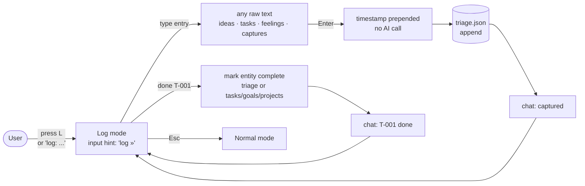
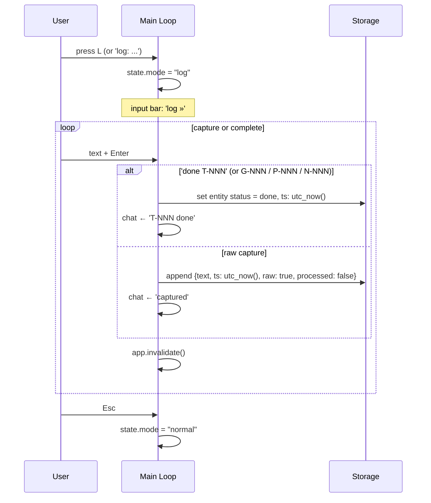

# Log Flow

## Purpose

Two functions in one mode:
1. **Capture** — frictionless entry of any raw thought into the triage inbox, <100ms, no AI.
2. **Complete** — mark any entity done using its ID (`done T-001`).

## High-Level

## Low-Level (swimlane)

## Rules

- No AI roundtrip — must complete in <100ms for both capture and completion.
- Raw text preserved exactly as typed.
- `processed: false` flag marks captured items for triage during the next plan or review.
- `done` works on any entity type: T-NNN, G-NNN, P-NNN, N-NNN.
- Multiple entries per session; Esc exits to normal mode.
- Timestamp is UTC ISO-8601.
