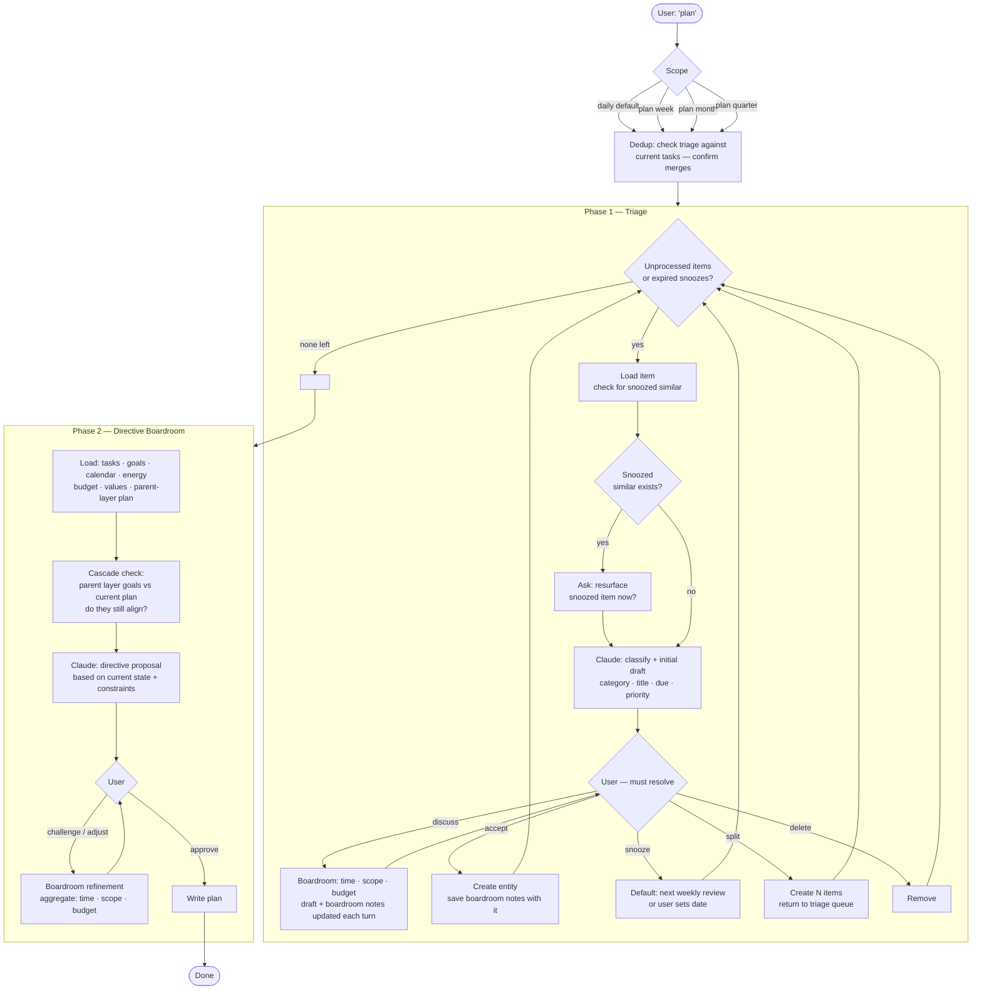
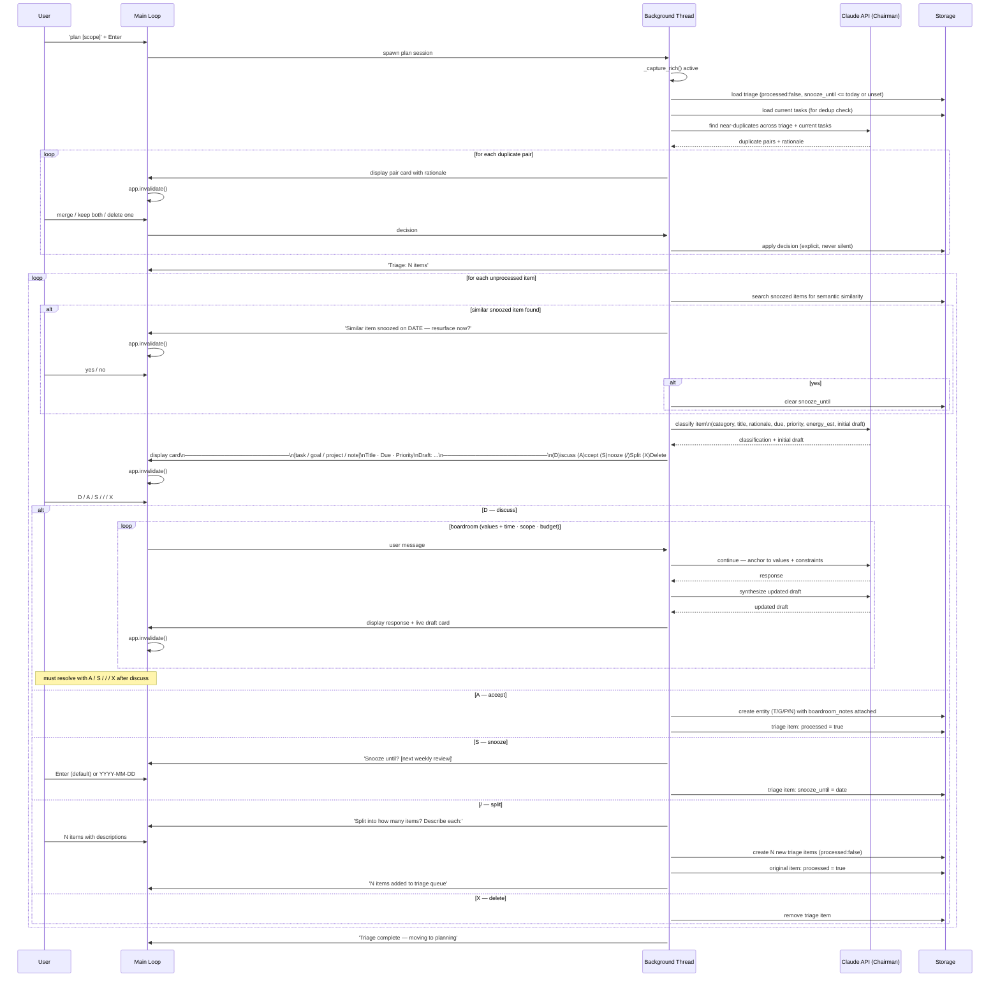
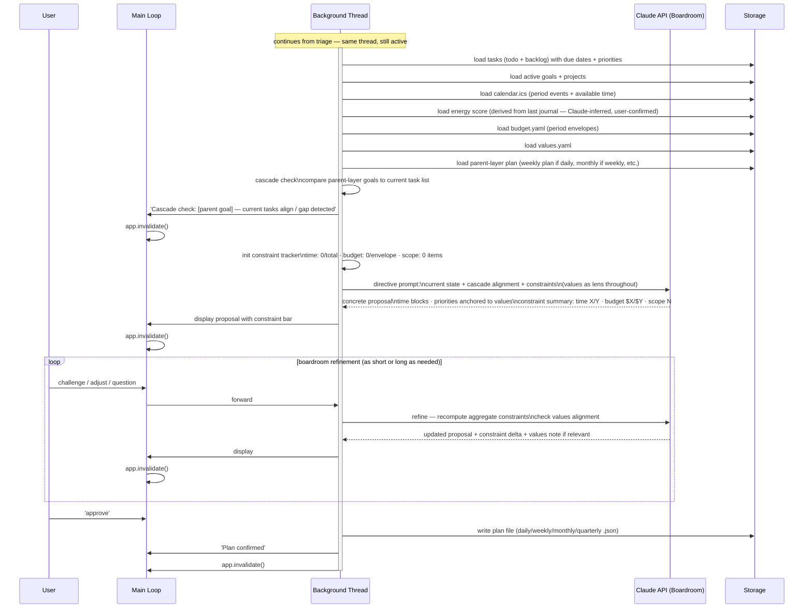

# Plan Flow — Rapid Replan

## Purpose

Fast path for replanning without a full review cycle. Use when context has shifted urgently
(project cancelled, priorities changed, returning from absence) and you need to replan now.

The boardroom posture is **directive**: Claude opens with a concrete proposal based on current
state. The user can challenge it, but the default is fast convergence, not open exploration.
That is what `review` is for.

`review` is the canonical cycle — it always ends with planning. Use `plan` only when
the reflection phases can genuinely be skipped.

Invocation: `plan` (daily L1) · `plan week` (L2) · `plan month` (L3) · `plan quarter` (L4)

---

## High-Level

---

## Phase 1 — Triage (swimlane)

---

## Phase 2 — Directive Boardroom (swimlane)

---

## Boardroom Depth by Horizon

| Scope | Review before plan | Boardroom posture | Typical length |
|-------|-------------------|-------------------|----------------|
| daily | none (rapid) | directive — Claude leads with concrete proposal | 1–3 exchanges |
| week | none (rapid) | directive with challenge space | 3–7 exchanges |
| month | recommend full `review month` instead | open if time allows | 5–15 exchanges |
| quarter | strongly recommend full `review quarter` | full boardroom | 15+ exchanges |

---

## Rules

- Every triage item must be resolved: (A)ccept · (S)nooze · (/)Split · (X)Delete. No limbo.
- Discuss is a tool to arrive at a resolution — user must still choose A/S///X after.
- Boardroom notes are saved with the entity on Accept — the reasoning trail is preserved.
- Split items return to the triage queue for the current session.
- Snooze default is next weekly review; user can override with a specific date.
- Snoozed items are hidden from triage until `snooze_until` is reached.
- Dedup checks triage against current tasks only — not goals or projects.
- Constraints (time · scope · budget) are measured in aggregate across all items in the period.
- Values are loaded and used as a lens at every boardroom exchange.
- Parent-layer plan is loaded for cascade alignment check before the boardroom opens.
- Plan written only after explicit 'approve' — nothing written silently.
