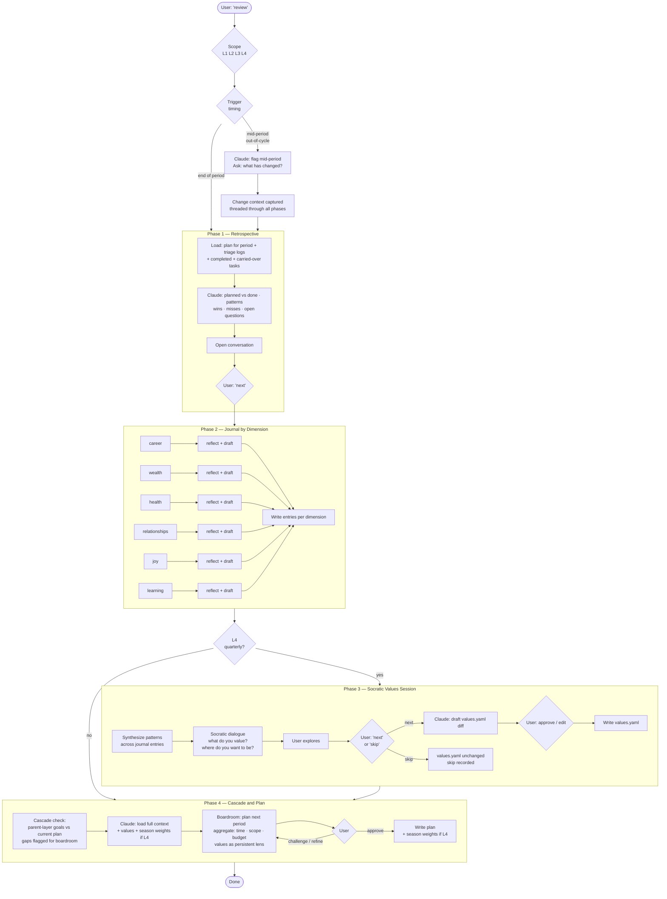
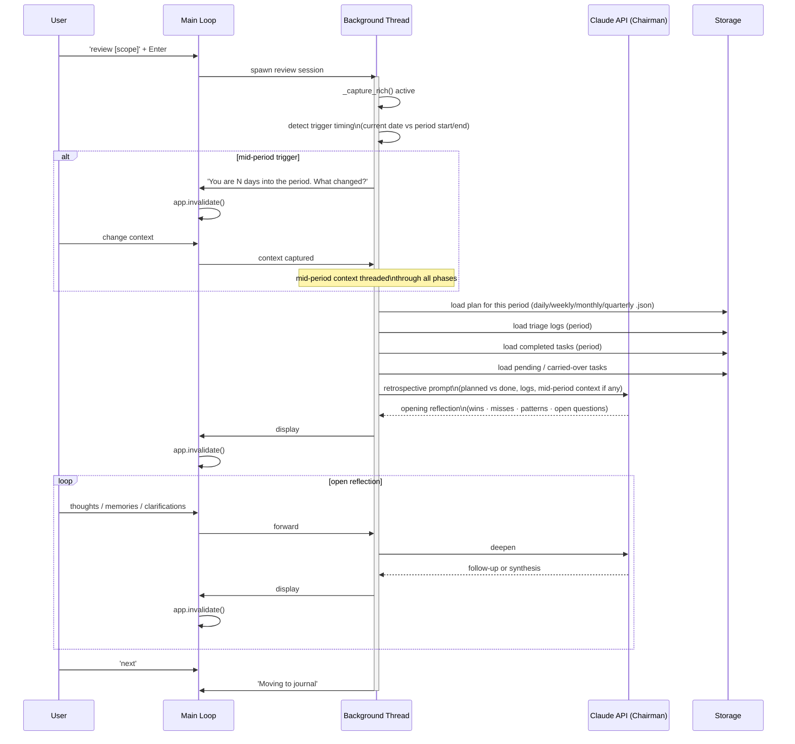
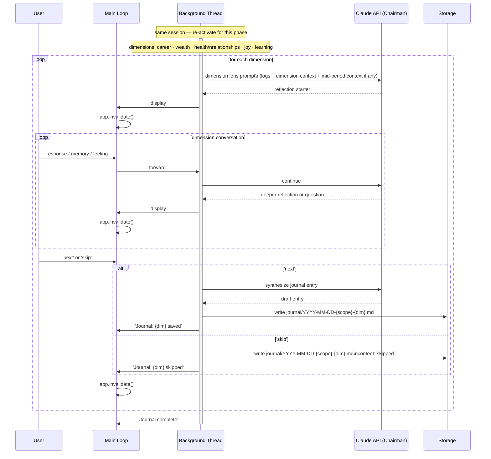
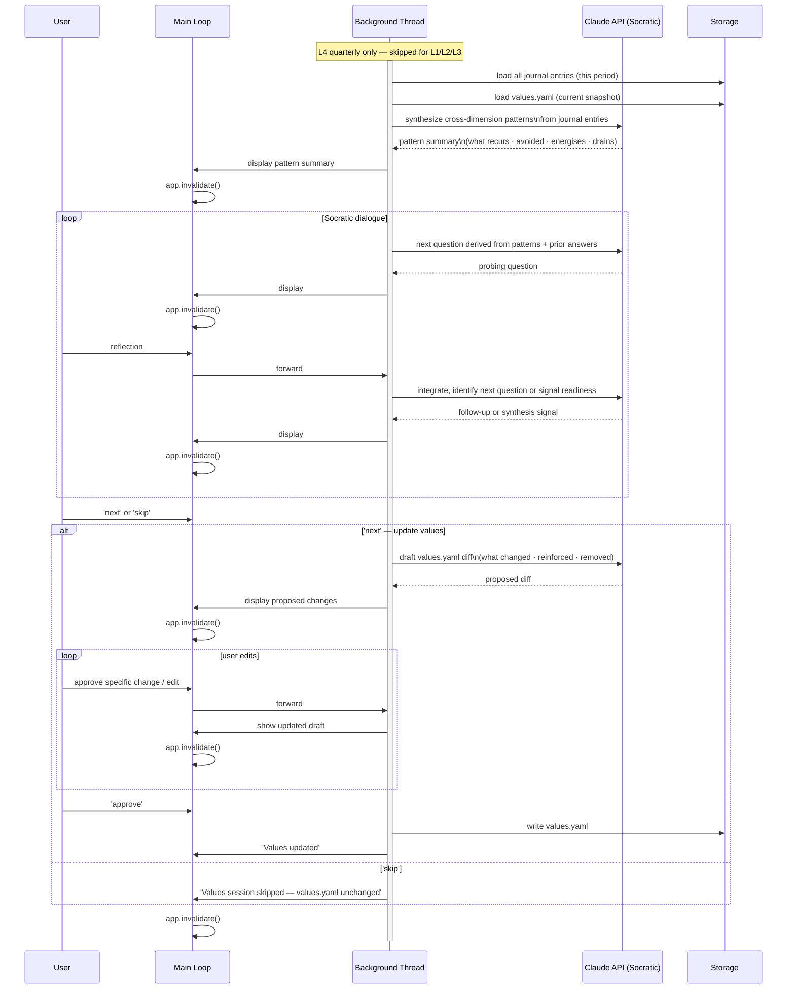
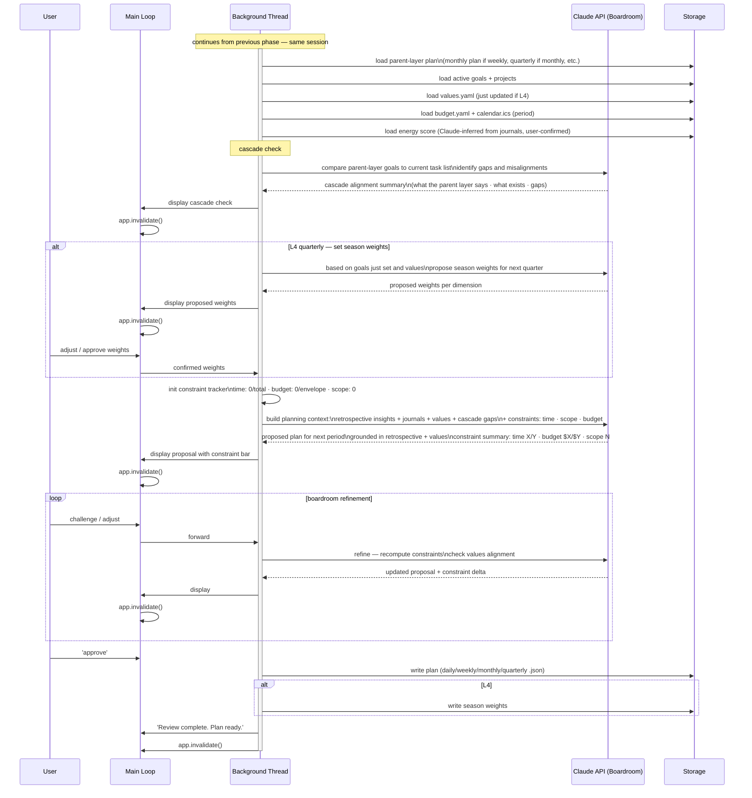

# Review Flow — Full Laminar Cycle

## Purpose

The canonical cycle. Review always ends with planning — they are phases of the same flow,
not separate actions. The depth of each phase scales with the time horizon and whether the
trigger is end-of-period or mid-period.

```
retrospective → journal → socratic (L4 only) → cascade + plan
```

For mid-period triggers, the retrospective compresses to "what changed?" and flows
directly into replanning. The phases are not skippable — but their depth is proportional.

Invocation: `review` (daily L1) · `review week` (L2) · `review month` (L3) · `review quarter` (L4)

---

## High-Level (four phases)



---

## Retrospective depth by horizon

| Scope | Mid-period trigger | End-of-period retrospective |
|-------|-------------------|---------------------------|
| daily | "What changed today?" → replan | How did today go? 2–4 exchanges |
| week | "What changed this week?" → replan | Full week reflection, 5–10 exchanges |
| month | "N days into month — what changed?" → replan | Full month reflection, journal |
| quarter | "N weeks into quarter — what changed?" → replan | Full quarter + Socratic + values |

---

## Phase 1 — Retrospective (swimlane)



---

## Phase 2 — Journal by Dimension (swimlane)



---

## Phase 3 — Socratic Values Session (swimlane — L4 only)



---

## Phase 4 — Cascade and Plan (swimlane)



---

## Rules

- Review always ends with planning — they are one laminar flow, not two commands.
- Mid-period triggers are detected automatically; change context threads through all phases.
- Retrospective depth scales with horizon — daily can be 2 exchanges; quarterly can be long.
- Journal entries written after each dimension — partial progress is preserved if interrupted.
- Each journal dimension can be skipped — recorded as skipped, not blank.
- Socratic session (Phase 3) runs only at L4 quarterly. It can be skipped; values.yaml is unchanged.
- `values.yaml` written only after explicit user approval of the proposed diff.
- Cascade check always runs at Phase 4 — parent-layer goals vs current task list, gaps flagged.
- Season weights set only at L4, after goals are finalised, before the boardroom opens.
- Values loaded as a persistent lens at every boardroom exchange, every horizon.
- Constraints (time · scope · budget) measured in aggregate across all items in the period.
- The boardroom in Phase 4 is **adaptive**: it reshapes existing tasks based on retrospective
  insights, not just generative. Boardroom notes from triage are available as context.
- Nothing written to storage until user says 'next' or 'approve'.
